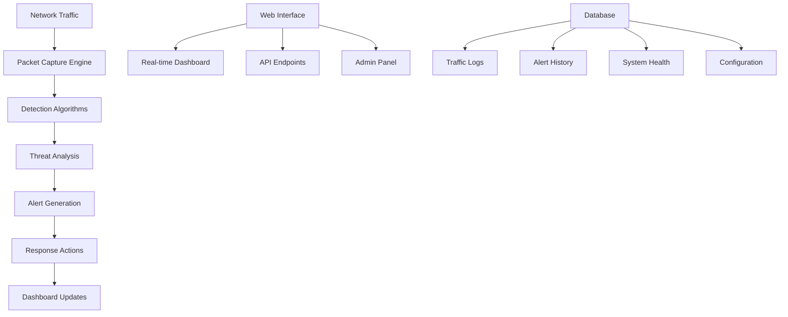

# 🛡️ D4DoS Detection System

[](https://python.org)
[](https://djangoproject.com)
[](LICENSE)
[](https://github.com/yourusername/d4dos-detection-system)
[](https://github.com/yourusername/d4dos-detection-system)

> **Advanced DDoS Detection System with Real-time Monitoring and Ultra-Modern Web Interface**

A comprehensive, enterprise-grade DDoS (Distributed Denial of Service) threat detection system built with Django, featuring real-time monitoring, advanced threat analysis, and a stunning glassmorphism web interface with curved corners.


## ✨ Features

### 🔍 **Advanced Threat Detection**
- **Real-time packet analysis** using Scapy for deep packet inspection
- **Multi-layer attack detection**: SYN floods, UDP floods, ICMP floods, volumetric attacks
- **Intelligent behavioral analysis** with machine learning-inspired algorithms
- **Customizable detection thresholds** for different network environments
- **Zero-day attack pattern recognition** through anomaly detection

### 🎨 **Ultra-Modern Web Interface**
- **Glassmorphism design** with curved corners and stunning visual effects
- **Real-time dashboards** with WebSocket-powered live updates
- **Interactive charts and visualizations** using Chart.js
- **Fully responsive design** optimized for desktop, tablet, and mobile
- **Dark/Light theme support** with smooth transitions
- **Progressive Web App (PWA)** capabilities

### ⚡ **Real-time Monitoring**
- **Live traffic analysis** with protocol breakdown and statistics
- **System health monitoring** (CPU, memory, disk, network utilization)
- **Active connection tracking** with geographic IP analysis
- **WebSocket-powered updates** for instant threat notifications
- **Historical trend analysis** with predictive insights

### 🛡️ **Security Management**
- **Automated IP blocking** with configurable duration and whitelist support
- **Comprehensive alert system** with severity levels and escalation
- **Incident response tracking** with detailed forensic logging
- **Mitigation action logging** for compliance and audit trails
- **Integration-ready APIs** for SIEM and security orchestration platforms

### 📊 **Analytics & Reporting**
- **Historical attack analysis** with trend identification
- **Attack pattern recognition** and threat intelligence
- **Network traffic statistics** with detailed breakdowns
- **Performance metrics** and system optimization insights
- **Exportable reports** in JSON, CSV, and PDF formats

## 🖥️ Screenshots

<div align="center">

### 🏠 **Dashboard**

*Real-time monitoring dashboard with glassmorphism design*

### 🚨 **Alert Management**

*Comprehensive security alerts with severity indicators*

### 📈 **Traffic Analysis**

*Advanced traffic analysis with interactive charts*

### ⚙️ **Admin Panel**

*Powerful admin interface for system management*

</div>

## 🚀 Quick Start

### 📋 **Prerequisites**

- **Python 3.8+** - [Download here](https://python.org/downloads/)
- **Git** - [Download here](https://git-scm.com/downloads)
- **Redis** (optional, for WebSocket support) - [Download here](https://redis.io/download)
- **Npcap/WinPcap** (Windows, for packet capture) - [Download here](https://npcap.org/)

### ⚡ **One-Command Setup**

```bash
# Clone and setup in one go
git clone https://github.com/yourusername/d4dos-detection-system.git
cd d4dos-detection-system
python setup_d4dos.py
```

### 🔧 **Manual Setup**

```bash
# 1. Clone the repository
git clone https://github.com/yourusername/d4dos-detection-system.git
cd d4dos-detection-system

# 2. Create virtual environment
python -m venv venv

# 3. Activate virtual environment
# Windows:
venv\Scripts\activate
# Linux/macOS:
source venv/bin/activate

# 4. Install dependencies
pip install -r requirements.txt

# 5. Environment setup
echo "SECRET_KEY=your-secret-key-here" > .env
echo "DEBUG=True" >> .env

# 6. Database setup
python manage.py makemigrations detection
python manage.py migrate

# 7. Create test data
python test_system.py

# 8. Create admin user (optional)
python manage.py createsuperuser

# 9. Start the server
python manage.py runserver
```

### 🌐 **Access Your System**

- **🖥️ Main Dashboard**: http://127.0.0.1:8000/
- **⚙️ Admin Panel**: http://127.0.0.1:8000/admin/
- **🔌 API Documentation**: http://127.0.0.1:8000/api/

## 📖 Usage Guide

### 🎮 **Getting Started**

1. **Start the detection engine** by clicking "Start Monitoring" on the dashboard
2. **Monitor real-time threats** in the main dashboard
3. **Manage alerts** in the alerts section
4. **Block suspicious IPs** manually or automatically
5. **Analyze traffic patterns** in the traffic analysis section
6. **Review system health** in the status monitoring panel

### 🔧 **Configuration**

Edit `d4dos_detection/settings.py` to customize detection parameters:

```python
DDOS_DETECTION = {
    'PACKET_THRESHOLD': 1000,      # Packets per minute threshold
    'IP_THRESHOLD': 500,           # Requests per IP per minute
    'MONITORING_INTERFACE': 'eth0', # Network interface to monitor
    'ALERT_COOLDOWN': 300,         # Seconds between alerts for same IP
    'SYN_FLOOD_THRESHOLD': 100,    # SYN packets threshold
    'UDP_FLOOD_THRESHOLD': 200,    # UDP packets threshold
    'ICMP_FLOOD_THRESHOLD': 50,    # ICMP packets threshold
}
```

### 🛠️ **Advanced Configuration**

<details>
<summary><strong>🔒 Security Settings</strong></summary>

```python
# Enhanced security configuration
SECURITY_SETTINGS = {
    'AUTO_BLOCK_THRESHOLD': 1000,   # Auto-block after X packets
    'WHITELIST_ENABLED': True,      # Enable IP whitelist
    'GEO_BLOCKING': ['CN', 'RU'],   # Block specific countries
    'RATE_LIMITING': {
        'ENABLED': True,
        'REQUESTS_PER_MINUTE': 60,
        'BURST_LIMIT': 100
    }
}
```

</details>

<details>
<summary><strong>📊 Monitoring Settings</strong></summary>

```python
# Monitoring configuration
MONITORING_SETTINGS = {
    'REAL_TIME_UPDATES': True,      # Enable real-time dashboard
    'UPDATE_INTERVAL': 5,           # Seconds between updates
    'HISTORY_RETENTION': 30,        # Days to keep historical data
    'LOG_LEVEL': 'INFO',           # Logging verbosity
    'EXPORT_FORMAT': 'JSON',       # Default export format
}
```

</details>

## 🔌 API Documentation

### 📡 **REST API Endpoints**

| Endpoint | Method | Description |
|----------|--------|-------------|
| `/api/detection-status/` | GET | Get detection engine status |
| `/api/start-monitoring/` | POST | Start detection engine |
| `/api/stop-monitoring/` | POST | Stop detection engine |
| `/api/dashboard-data/` | GET | Get dashboard statistics |
| `/api/alerts/` | GET | List security alerts |
| `/api/traffic-logs/` | GET | Get traffic logs |
| `/api/blocked-ips/` | GET, POST | Manage blocked IPs |
| `/api/system-metrics/` | GET | Get system performance |
| `/api/threat-analysis/` | GET | Get threat analysis data |

### 📝 **API Usage Examples**

<details>
<summary><strong>🔍 Get Detection Status</strong></summary>

```bash
curl -X GET http://localhost:8000/api/detection-status/
```

```json
{
  "status": "success",
  "data": {
    "running": true,
    "packet_buffer_size": 1024,
    "monitored_ips": 45,
    "active_connections": 127,
    "last_update": "2024-12-20T10:30:00Z"
  }
}
```

</details>

<details>
<summary><strong>🚀 Start Monitoring</strong></summary>

```python
import requests

response = requests.post('http://localhost:8000/api/start-monitoring/')
print(response.json())
# {"status": "success", "message": "Detection engine started successfully"}
```

</details>

<details>
<summary><strong>🚫 Block IP Address</strong></summary>

```python
import requests

data = {
    'ip_address': '192.168.1.100',
    'reason': 'Suspicious activity detected',
    'duration': 24  # hours, 0 for permanent
}

response = requests.post('http://localhost:8000/api/block-ip/', json=data)
print(response.json())
```

</details>

## 🏗️ Architecture

### 🔧 **System Components**



### 🧠 **Detection Algorithms**

1. **Statistical Analysis** - Baseline traffic patterns and anomaly detection
2. **Signature-based Detection** - Known attack pattern recognition
3. **Behavioral Analysis** - Machine learning-inspired threat identification
4. **Rate Limiting** - Request frequency analysis per IP/subnet
5. **Protocol Analysis** - Deep packet inspection for protocol anomalies

### 🎯 **Attack Detection Types**

| Attack Type | Detection Method | Response Time |
|-------------|------------------|---------------|
| **SYN Flood** | TCP flag analysis + connection state tracking | < 5 seconds |
| **UDP Flood** | Packet rate analysis + payload inspection | < 3 seconds |
| **ICMP Flood** | ICMP rate limiting + size analysis | < 2 seconds |
| **HTTP Flood** | Application layer request analysis | < 10 seconds |
| **Volumetric** | Bandwidth utilization monitoring | < 5 seconds |
| **Slowloris** | Connection duration analysis | < 30 seconds |

## 🛠️ Technology Stack

### 🖥️ **Backend**
- **Django 4.2+** - Web framework and API
- **Django REST Framework** - RESTful API development
- **Django Channels** - WebSocket support for real-time updates
- **Scapy** - Advanced packet manipulation and analysis
- **psutil** - System and process monitoring
- **NumPy** - Numerical computations for threat analysis

### 🎨 **Frontend**
- **HTML5** - Modern semantic markup
- **CSS3** - Advanced styling with glassmorphism effects
- **JavaScript (ES6+)** - Interactive functionality
- **Chart.js** - Data visualization and charts
- **WebSocket API** - Real-time communication

### 🗄️ **Database & Storage**
- **SQLite** - Development database
- **PostgreSQL** - Production database support
- **Redis** - Caching and WebSocket message broker

### 🔧 **DevOps & Deployment**
- **Docker** - Containerization support
- **Gunicorn** - WSGI HTTP Server
- **Nginx** - Reverse proxy and static file serving
- **systemd** - Service management

## 🚀 Deployment

### 🐳 **Docker Deployment**

```bash
# Build and run with Docker
docker-compose up -d

# Or build manually
docker build -t d4dos-detection .
docker run -p 8000:8000 d4dos-detection
```

### ☁️ **Cloud Deployment**

<details>
<summary><strong>🌊 DigitalOcean Deployment</strong></summary>

```bash
# Create droplet and setup
git clone https://github.com/yourusername/d4dos-detection-system.git
cd d4dos-detection-system
sudo apt update && sudo apt install python3-pip redis-server
pip3 install -r requirements.txt
python3 manage.py migrate
python3 manage.py collectstatic
gunicorn d4dos_detection.wsgi:application --bind 0.0.0.0:8000
```

</details>

<details>
<summary><strong>🚀 Heroku Deployment</strong></summary>

```bash
# Install Heroku CLI and deploy
heroku create your-d4dos-app
heroku addons:create heroku-postgresql:hobby-dev
heroku addons:create heroku-redis:hobby-dev
git push heroku main
heroku run python manage.py migrate
```

</details>

### 🖥️ **Production Setup**

```bash
# Production configuration
cp .env.example .env.production
# Edit .env.production with your settings

# Run with Gunicorn
gunicorn d4dos_detection.wsgi:application \
    --workers 4 \
    --bind 0.0.0.0:8000 \
    --access-logfile access.log \
    --error-logfile error.log \
    --daemon
```

## 🧪 Testing

### 🔬 **Run Tests**

```bash
# Run all tests
python manage.py test

# Run specific test modules
python manage.py test detection.tests.test_detection_engine
python manage.py test detection.tests.test_api_views

# Generate test data
python test_system.py

# Performance testing
python manage.py test detection.tests.test_performance
```

### 📊 **Load Testing**

```bash
# Install Apache Bench
sudo apt-get install apache2-utils

# Test API endpoints
ab -n 1000 -c 10 http://localhost:8000/api/dashboard-data/

# Test WebSocket connections
python scripts/websocket_load_test.py
```

### 🛡️ **Security Testing**

```bash
# Test attack detection with safe simulation
python scripts/simulate_attacks.py --safe-mode

# Penetration testing with custom scripts
python scripts/pen_test.py --target localhost:8000
```

## 📚 Documentation

### 📖 **Additional Resources**

- **[Installation Guide](docs/installation.md)** - Detailed setup instructions
- **[API Reference](docs/api-documentation.md)** - Complete API documentation
- **[Configuration Guide](docs/configuration.md)** - Advanced configuration options
- **[Deployment Guide](docs/deployment.md)** - Production deployment strategies
- **[Troubleshooting](docs/troubleshooting.md)** - Common issues and solutions
- **[Contributing](CONTRIBUTING.md)** - How to contribute to the project
- **[Security Policy](SECURITY.md)** - Security guidelines and reporting

### 🎓 **Tutorials**

- **[Getting Started Tutorial](docs/tutorials/getting-started.md)**
- **[Custom Detection Rules](docs/tutorials/custom-rules.md)**
- **[API Integration Examples](docs/tutorials/api-integration.md)**
- **[Advanced Configuration](docs/tutorials/advanced-config.md)**

## 🤝 Contributing

We welcome contributions from the community! Here's how you can help:

### 🛠️ **Development Setup**

```bash
# Fork the repository and clone your fork
git clone https://github.com/yourusername/d4dos-detection-system.git
cd d4dos-detection-system

# Create a development branch
git checkout -b feature/your-feature-name

# Install development dependencies
pip install -r requirements-dev.txt

# Run pre-commit hooks
pre-commit install

# Make your changes and test
python manage.py test
python test_system.py

# Submit a pull request
git push origin feature/your-feature-name
```

### 📝 **Contribution Guidelines**

- **Follow PEP 8** coding standards
- **Write comprehensive tests** for new features
- **Update documentation** for any API changes
- **Use meaningful commit messages**
- **Ensure backward compatibility**

### 🐛 **Bug Reports**

Found a bug? Please create an issue with:
- **Detailed description** of the problem
- **Steps to reproduce** the issue
- **Expected vs actual behavior**
- **System information** (OS, Python version, etc.)
- **Log files** if applicable

### 💡 **Feature Requests**

Have an idea for improvement? We'd love to hear it! Please include:
- **Clear description** of the proposed feature
- **Use case scenarios** and benefits
- **Implementation suggestions** if you have any
- **Mockups or examples** if applicable

## 📄 License

This project is licensed under the **MIT License** - see the [LICENSE](LICENSE) file for details.

### 🔒 **Additional Terms**

- This software is intended for **educational and legitimate security purposes only**
- Users must ensure **compliance with applicable laws** in their jurisdiction
- Only use on **networks you own** or have explicit permission to monitor
- The authors disclaim responsibility for **misuse of this software**

## 🆘 Support

### 💬 **Get Help**

- **📚 Documentation**: [Wiki](https://github.com/yourusername/d4dos-detection-system/wiki)
- **🐛 Issues**: [GitHub Issues](https://github.com/yourusername/d4dos-detection-system/issues)
- **💭 Discussions**: [GitHub Discussions](https://github.com/yourusername/d4dos-detection-system/discussions)
- **📧 Email**: support@d4dos-detection.com

### 🆘 **Emergency Support**

For critical security issues, please email: **security@d4dos-detection.com**

## 🙏 Acknowledgments

### 🏆 **Credits**

- **[Scapy Team](https://scapy.net/)** - For the excellent packet manipulation library
- **[Django Team](https://djangoproject.com/)** - For the robust web framework
- **[Chart.js Team](https://chartjs.org/)** - For beautiful data visualizations
- **[Security Research Community](https://www.security-research.org/)** - For DDoS detection methodologies

### 🌟 **Special Thanks**

- All contributors who have helped improve this project
- The cybersecurity community for valuable feedback
- Open source projects that inspired this work

## 📊 Project Statistics


## 🗺️ Roadmap

### 🔮 **Version 2.0 (Q1 2025)**
- [ ] **Machine Learning Integration** - AI-powered threat detection
- [ ] **Advanced GeoIP Analysis** - Geographic threat intelligence
- [ ] **Email/SMS Notifications** - Real-time alert delivery
- [ ] **Docker Compose Setup** - One-click deployment
- [ ] **Kubernetes Support** - Container orchestration
- [ ] **Multi-tenancy** - Support for multiple organizations

### 🚀 **Version 2.1 (Q2 2025)**
- [ ] **SIEM Integration** - Splunk, ELK, QRadar connectors
- [ ] **Cloud Templates** - AWS, Azure, GCP deployment
- [ ] **Mobile Application** - iOS and Android apps
- [ ] **Advanced Forensics** - Detailed attack analysis
- [ ] **Threat Intelligence** - External feed integration
- [ ] **Custom Dashboards** - User-configurable interfaces

### 🌐 **Version 3.0 (Future)**
- [ ] **Distributed Detection** - Multi-node deployment
- [ ] **Blockchain Integration** - Immutable threat logs
- [ ] **AR/VR Interface** - 3D network visualization
- [ ] **Quantum-Safe Encryption** - Future-proof security

---

<div align="center">

### 🛡️ **D4DoS Detection System**

**Professional DDoS Protection for the Modern World**

[🌟 Star this repo](https://github.com/yourusername/d4dos-detection-system/stargazers) • [🐛 Report Bug](https://github.com/yourusername/d4dos-detection-system/issues) • [💡 Request Feature](https://github.com/yourusername/d4dos-detection-system/issues)

**Built with ❤️ by the cybersecurity community**

</div>
